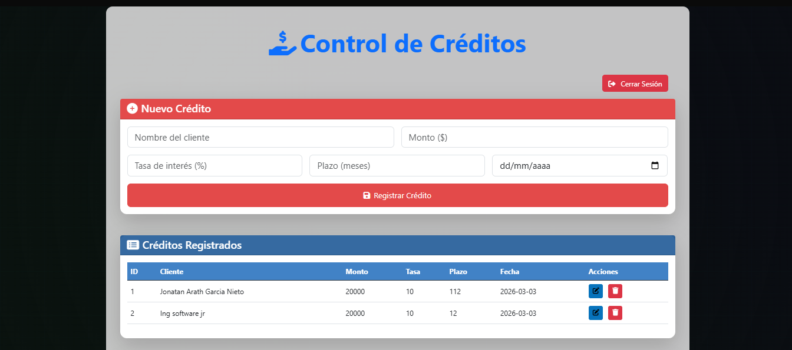
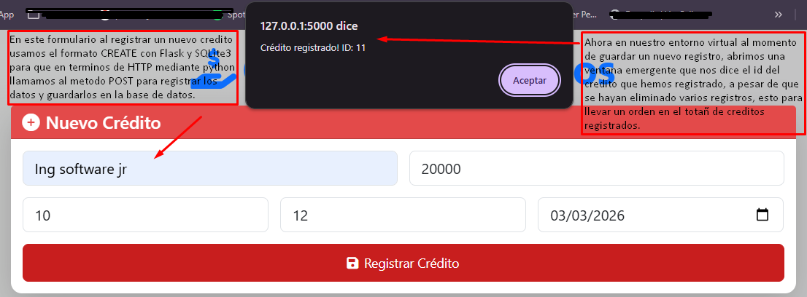
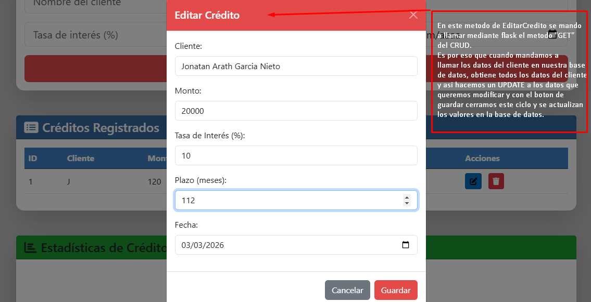
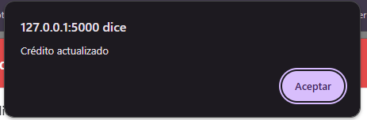
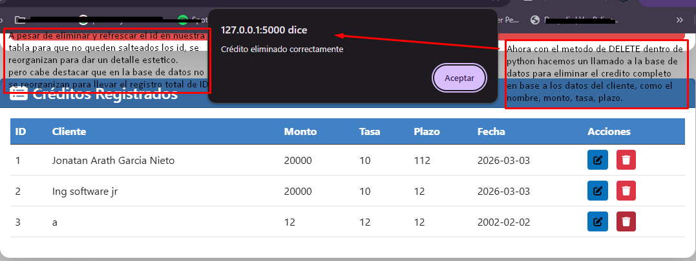
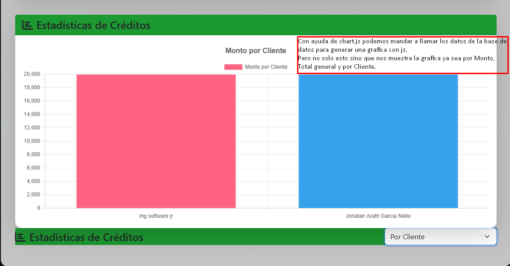
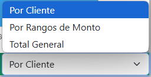

# Sistema de Gestión de Créditos CRUD

<a href="https://github.com/ArathBl4ckH4t">
    
</a>

## 📑 Tabla de Contenidos
1. [Introducción](#-introducción)
2. [Capturas y Funcionalidades](#-capturas-y-funcionalidades)
3. [Funcionalidades Clave](#-funcionalidades-clave)
4. [Tecnologías Utilizadas](#-tecnologías-utilizadas)
5. [Endpoints API](#-endpoints-api)
6. [Instalación del proyecto](#-instalación-del-proyecto)
7. [Estructura del Proyecto](#-estructura-del-proyecto)
8. [Licencia](#-licencia)
9. [Autor](#-autor)

Aplicación web para administrar créditos financieros con Flask y SQLite.

## 🌟 Introducción
Sistema web para gestión de créditos financieros desarrollado con:
- **Python Flask** para el backend
- **SQLite** como base de datos
- **Html, CSS, Js, Bootstrap** para el frontend
- **Chart.js** para visualización de datos en Graficos

Permite realizar operaciones CRUD completas y genera reportes gráficos interactivos.

## 🎯 Objetivos

- Registrar créditos con: cliente, monto, tasa de interés, plazo y fecha
- Visualizar estadísticas en gráficos interactivos
- Realizar operaciones CRUD completas
- Implementar autenticación básica

## ✨ Características Principales

### Backend

- **API RESTful** con endpoints para:
  - Crear/Leer/Actualizar/Eliminar créditos
  - Generar reportes estadísticos
- Base de datos SQLite con tabla `creditos`:
  ```sql
  CREATE TABLE creditos (
    id INTEGER PRIMARY KEY AUTOINCREMENT,
    cliente TEXT NOT NULL,
    monto REAL NOT NULL,
    tasa_interes REAL NOT NULL,
    plazo INTEGER NOT NULL,
    fecha_otorgamiento TEXT NOT NULL
  );

### Frontend
- Interfaz responsive con Bootstrap 5
- Tabla dinámica con acciones
- Gráficos con Chart.js
- Formularios con validación


## 📷 Capturas y Funcionalidades

### 1. Login

-   Formato de entrada para que unicamente se logeen los superusuarios para poder ingresar creditos nuevos.


-   El index es intuitivo con ayuda de bootstrap en donde se cumplen las condicionales de los metodos de Flask



### 2. Registro de Créditos

-   Formulario con validación en tiempo real.
-   Persistencia en base de datos SQLite.
-   Feedback visual de éxito/error.



### 3. Editar Creditos

-   Con ayuda de el metodo GET con flask podremos obtener los datos de los usuarios y los creditos directo de la    base  de datos para asi poder actualizarlos con un UPDATE.
-   Modal interactivo con Bootstrap.
-   Actualización mediante PUT.
-   Persistencia inmediata.



-   Despues de clicker el boton Guardar nos salta una ventana emergente donde se puede oberservar el mensaje
    dependiendo si la consulta fue exitosa o no para poder editar y hacer un UPDATE exitoso.



### 4. Eliminar Creditos

-    De la misma forma con uso de el metodo DELETE se manda a llamar a la base de datos para identificar
    el id con el que se registro el credito de un cliente y asi poder eliminarlo de nuestra db.
-   Actualización automática de la tabla.
-   Confirmacion mediante dialogo.



### 5. Grafica Creditos

-   En este apartado podemos observar de primera mano que las graficas que nos muestra son las de Monto por cliente 
    junto con su total.
-   Gráfico principal con Chart.js.
-   Actualización dinámica con AJAX.
-   Selector de tipo de visualización.



-   Como ya se dijo en el punto anterior tenemos un selector de visualizacion de grafico dependiendo
    las necesidades.
-   Por ejemplo por Rangos de Monto, el cual nos muestra un grafico circular para ver la mayor cantidad de creditos.
-   Y la ultima que es el total general nos ayuda a observar todos los creditos en una sola grafica.

 


## 🔑 Funcionalidades Clave
### Métodos HTTP Implementados
| Método | Ruta               | Acción                 |
|--------|--------------------|------------------------|
| GET    | /api/creditos      | Listar todos           |
| POST   | /api/creditos      | Crear nuevo            |
| PUT    | /api/creditos/<id> | Actualizar existente   |
| DELETE | /api/creditos/<id> | Eliminar registro      |

## 🛠 Tecnologías Utilizadas

| Componente       | Tecnología               |
|------------------|--------------------------|
| Backend          | Python Flask             |
| Base de Datos    | SQLite                   |
| Frontend         | HTML5, CSS3, JavaScript  |
| Gráficos         | Chart.js                 |
| Estilos          | Bootstrap 5              |


## 📡 Endpoints API

    ```bash
@app.route('/api/creditos', methods=['GET', 'POST'])
    ```
    ```bash
@app.route('/api/creditos/<int:credito_id>', methods=['PUT', 'DELETE'])
    ```
    ```bash
@app.route('/api/creditos/distribucion/cliente', methods=['GET'])
    ```
    ```bash
@app.route('/api/creditos/distribucion/montos', methods=['GET'])
    ```


## 🚀 Instalación del proyecto

**1. Clonar repositorio:**
```bash
git clone https://github.com/ArathBl4ckH4t/crud-api-flask.git
cd crud-api-flask

**2. Crear entorno virtual:**
    ```bash
    python -m venv env
    source env/bin/activate  # Linux/Mac
    env\Scripts\activate     # Windows
    ```

**3. Instalar Dependencias:**
    ```bash
    pip install -r requirements.txt
    ```

**4. Ejecutar Aplicacion:**
    ```bash
    flask run
    ```

**5. Acceder al sistema:**
    ```bash
    http://localhost:5000
🔑 Credenciales de administrador:
    Usuario: Deltadata12!
    Contraseña: Deltadata12!
    ```


##  📂 Estructura del Proyecto

```
crud-api-flask/
├── env/
├── static/
│   ├── css/styles.css
│   └── js/main.js
├── templates/
│   ├── index.html
│   └── login.html
├── img/
│   ├── *.png (8 capturas)
├── app.py
├── requirements.txt
└── creditos.db
```

##  📜 Licencia

**MIT License**

Copyright (c) 2025 ArathBl4ckH4t

Permiso concedido para uso, modificación y distribución...
(Texto completo en LICENSE.md)

## 👤 Autor

<a href="https://github.com/ArathBl4ckH4t">
    
</a>

## 💻 Contacto

- **WhatsApp:** [+52 5613845080](https://wa.me/525613845080)
- **LinkedIn:** [Arath Nieto](https://www.linkedin.com/in/jonatan-arath-garc%C3%ADa-nieto-332698218/)
- **Portafolio:** [Visita mi portafolio](https://arathbl4ckh4t.github.io/ArathBl4ckH4t.github.io-portfolio/)


CRUD Python-Flask
© 2025 [ArathNieto]


